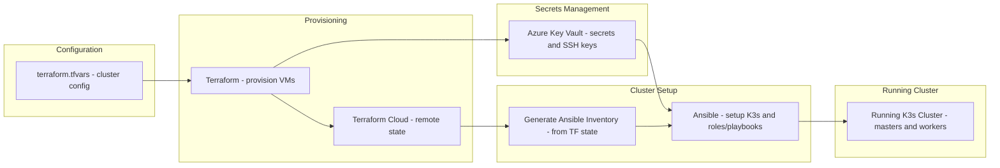

# k3s-terraform-ansible-cluster
Spin up **flexible, scalable, and compliant K3s clusters** in **Azure Cloud**(for now) from a single configuration file.
# Features
- [x] Modular azure cluster creation
- [x] remote terraform state support(Terraform Cloud)
- [x] Managed ssh keys through azure key vault
- [x] Ansible to fully setup and config kubernetes in the clusters
- [x] Modular ansible with playbooks and roles
- [x] Teleport with github SSO

# Prerequisits
- You need an azure account(auth through the cli `az login`, or create a principal and save the tokens)
- create a vault called `wasp-vault` in your az account
- optional: terraform cloud account for remote state managment

# How to setup
**1.** create `terraform.tfvars` in `terraform/` with your desired configs:


```HCL
clusters = {
  france = {
    cluster_name   = "france-cluster-1"
    region         = "francecentral"
    admin_username = "azureuser"
    workers = [
      {
        name          = "worker-group-1"
        instance_size = "Standard_B1ms"
        disk_size     = 30
        count         = 13  
        tags          = { role = "ms1" }
      },
      {
        name          = "worker-group-2"
        instance_size = "Standard_B1ms"
        disk_size     = 50
        count         = 5
        tags          = { role = "dbs" }
      }
    ]
  }

  spain = {
    cluster_name   = "spain-cent-test"
    region         = "spaincentral"
    admin_username = "azureuser"
    workers = [
      {
        name          = "wkr-1"
        instance_size = "Standard_B1ms"
        disk_size     = 30
        count         = 13  
        tags          = { role = "dev" }
      },
      {
        name          = "wkr-2"
        instance_size = "Standard_B1ms"
        disk_size     = 50
        count         = 5
        tags          = { role = "test" }
      }
    ]
  }

}
```
**2. Provision infrastructure** with Terraform:
```bash
bash ./scripts/run_tf.sh
```

**3. Generate Ansible inventory** from Terraform state:
```sh
bash ./scripts/generate_ansible_inv.sh
```

**4. Run Ansible playbooks** to setup K3s and Teleport on master and worker nodes :

```sh
bash ./scripts/install_k3s.sh
```
to configure the master with Teleport:
```sh
bash ./scripts/setup_teleport.sh
```
 
# Workflow Diagram

